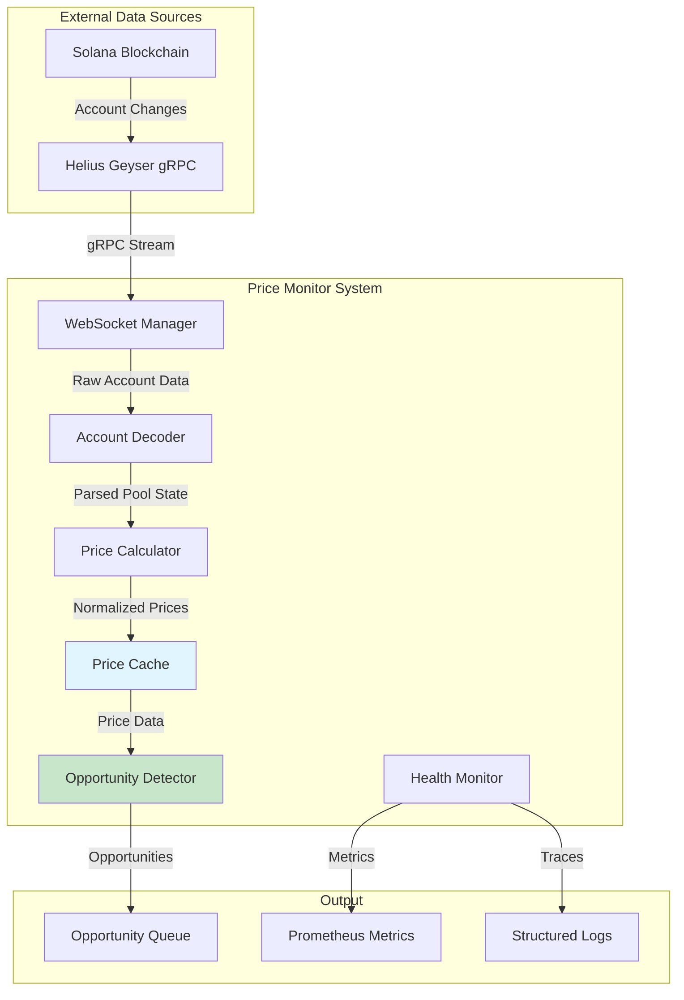
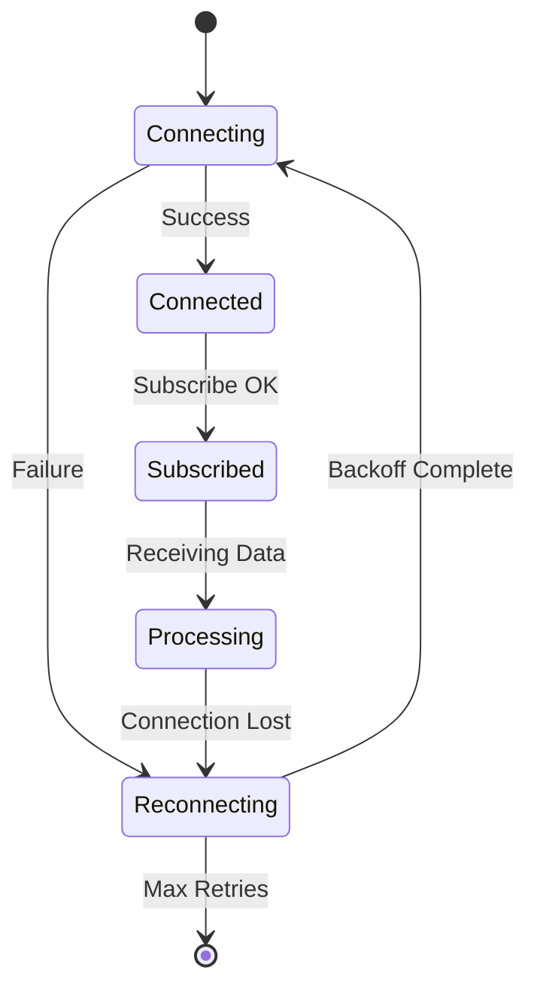
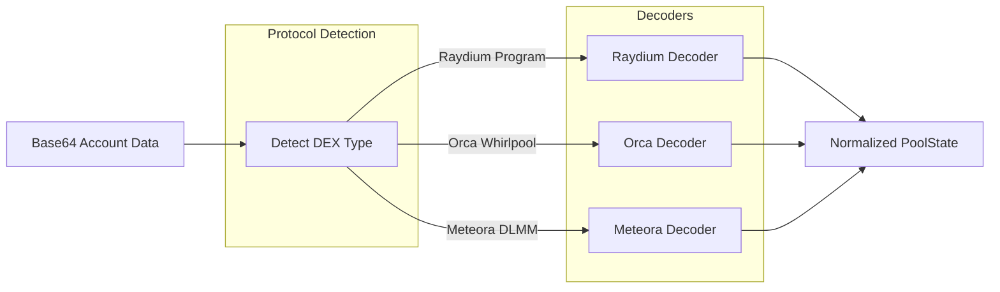
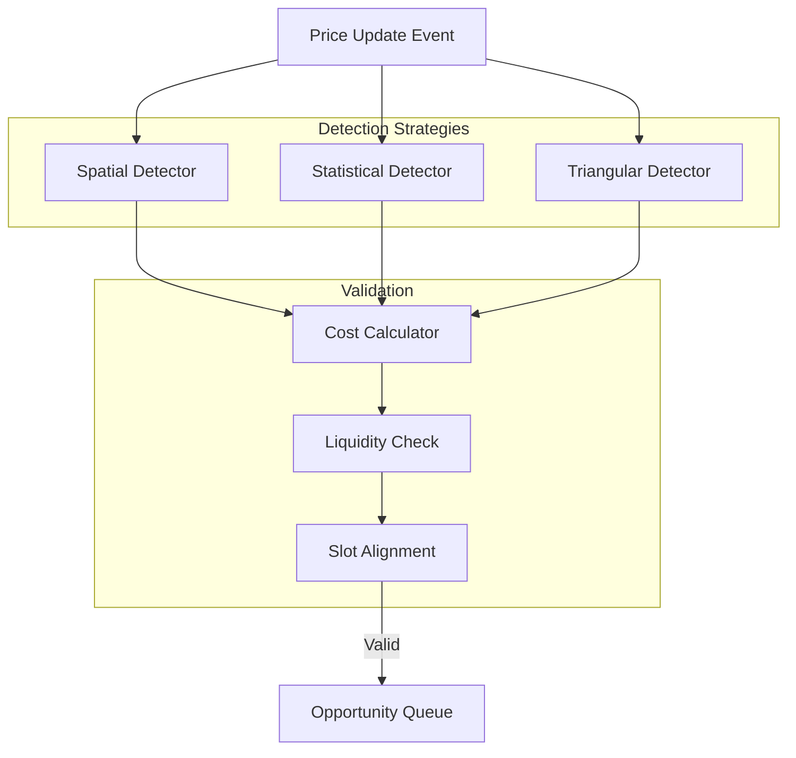
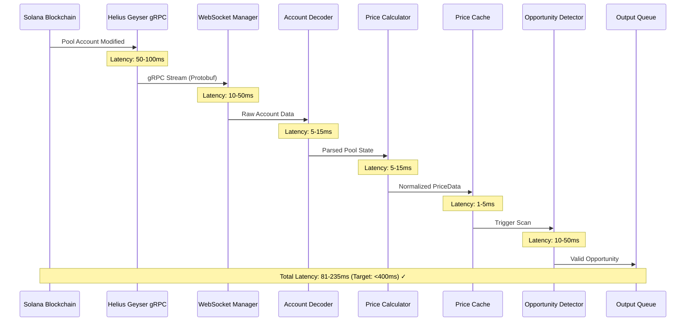
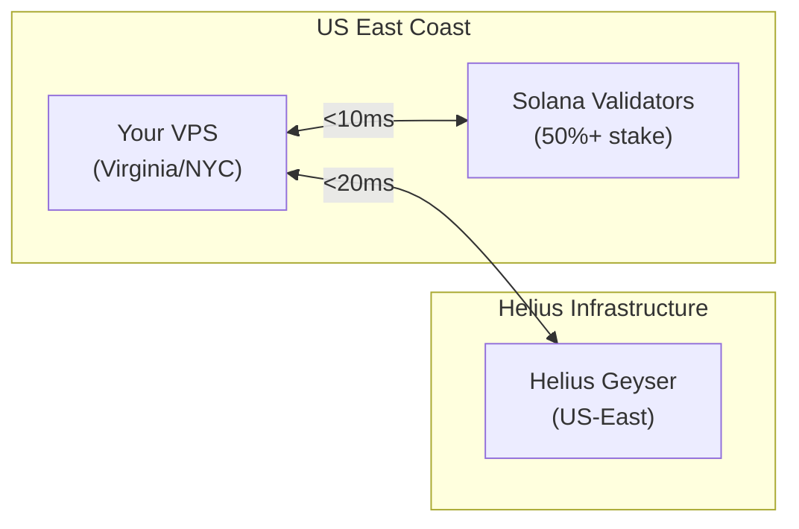

# Architecture Design Document

## Solana Real-Time Price Monitoring & Arbitrage Detection System

**Version**: 1.0  
**Last Updated**: January 2026  
**Status**: Implementation Ready

---

## 1. EXECUTIVE SUMMARY

### 1.1 Purpose

This document defines the architecture for a high-performance, real-time price monitoring system for Solana DEXs. The system forms the foundational infrastructure for arbitrage opportunity detection, achieving **<400ms latency** from on-chain event to opportunity output.

### 1.2 Key Architectural Decisions

| Decision           | Choice              | Rationale                                                       |
| ------------------ | ------------------- | --------------------------------------------------------------- |
| **Language**       | Rust                | Zero-cost abstractions, native Solana SDK, fearless concurrency |
| **Async Runtime**  | Tokio               | Industry standard, handles 15,000+ tasks/second                 |
| **Data Ingestion** | Helius Geyser gRPC  | 50-200ms latency vs 500-2000ms polling                          |
| **Cache**          | DashMap (Lock-Free) | O(1) lookups, non-blocking concurrent access                    |
| **Serialization**  | Borsh               | Solana-native, deterministic binary format                      |

### 1.3 Performance Targets

| Metric                  | Target            | Architecture Support                |
| ----------------------- | ----------------- | ----------------------------------- |
| End-to-end latency      | <400ms            | Geyser streaming + in-memory cache  |
| Price update processing | <20ms             | Borsh deserialization + tokio async |
| Cache lookup            | <5ms              | HashMap with RwLock                 |
| Opportunity detection   | <50ms             | Parallel strategy scanning          |
| Throughput              | 1000+ updates/sec | Multi-threaded tokio runtime        |

---

## 2. HIGH-LEVEL ARCHITECTURE

### 2.1 System Overview



### 2.2 Core Modules

| Module        | Responsibility                       | Key Dependencies             |
| ------------- | ------------------------------------ | ---------------------------- |
| `websocket/`  | Connection management, reconnection  | `tokio-tungstenite`, `tokio` |
| `decoder/`    | Parse Raydium/Orca/Meteora pool data | `borsh`, `solana-sdk`        |
| `cache/`      | In-memory price storage with TTL     | `std::collections::HashMap`  |
| `calculator/` | AMM/CLMM price computation           | `statrs` (statistics)        |
| `detector/`   | Multi-strategy opportunity scanning  | Custom algorithms            |
| `models/`     | Shared data structures               | `serde`, `chrono`            |

---

## 3. COMPONENT ARCHITECTURE

### 3.1 WebSocket Manager

**Purpose**: Maintain persistent connections to Helius Geyser gRPC for real-time pool updates.



**Key Design Patterns**:

```rust
// Connection with exponential backoff
pub struct WebSocketManager {
    url: String,
    subscriptions: Vec<Pubkey>,        // Pool addresses
    reconnect_attempts: u32,
    max_reconnect_delay: Duration,     // Cap at 30 seconds
}

impl WebSocketManager {
    pub async fn connect_with_backoff(&mut self) -> Result<()> {
        let delay = Duration::from_millis(
            100 * 2u64.pow(self.reconnect_attempts.min(8))
        );
        tokio::time::sleep(delay.min(self.max_reconnect_delay)).await;
        self.connect().await
    }
}
```

**2026 Best Practice**: Use Helius Geyser gRPC (Yellowstone) or LaserStream instead of standard WebSockets for:

- 50-200ms latency (vs 500-2000ms with polling)
- Protobuf-encoded data (more efficient than JSON)
- Direct validator memory access
- Automatic failover support

### 3.2 Account Decoder

**Purpose**: Parse binary account data from different DEX protocols.



**Raydium AMM Layout** (Constant Product):

```rust
#[derive(BorshDeserialize)]
pub struct RaydiumAmmInfo {
    pub status: u64,
    pub nonce: u64,
    pub order_num: u64,
    pub depth: u64,
    pub coin_decimals: u64,
    pub pc_decimals: u64,
    pub state: u64,
    pub reset_flag: u64,
    pub min_size: u64,
    pub vol_max_cut_ratio: u64,
    pub amount_wave_ratio: u64,
    pub coin_lot_size: u64,
    pub pc_lot_size: u64,
    pub min_price_multiplier: u64,
    pub max_price_multiplier: u64,
    pub sys_decimal_value: u64,
    // Vault balances - CRITICAL for price calculation
    pub coin_vault: Pubkey,
    pub pc_vault: Pubkey,
    pub coin_vault_balance: u64,  // Reserve A
    pub pc_vault_balance: u64,    // Reserve B
    // ... additional fields
}
```

**Orca Whirlpool Layout** (Concentrated Liquidity):

```rust
#[derive(BorshDeserialize)]
pub struct WhirlpoolState {
    pub whirlpool_bump: [u8; 1],
    pub tick_spacing: u16,
    pub tick_spacing_seed: [u8; 2],
    pub fee_rate: u16,              // Basis points (e.g., 30 = 0.3%)
    pub protocol_fee_rate: u16,
    pub liquidity: u128,            // Current liquidity
    pub sqrt_price: u128,           // Q64.64 fixed-point
    pub tick_current_index: i32,
    pub fee_growth_global_a: u128,
    pub fee_growth_global_b: u128,
    pub token_mint_a: Pubkey,
    pub token_vault_a: Pubkey,
    pub token_mint_b: Pubkey,
    pub token_vault_b: Pubkey,
    // ... additional fields
}
```

### 3.3 Price Cache

**Purpose**: Store and retrieve prices with O(1) complexity and automatic staleness detection.

**Data Structure**:

```rust
use dashmap::DashMap;
use std::sync::Arc;
use chrono::{DateTime, Utc};

#[derive(Clone, Debug)]
pub struct PriceData {
    pub price: f64,                      // Normalized price
    pub liquidity: u64,                  // Pool liquidity in USD
    pub slot: u64,                       // Solana slot number
    pub timestamp: DateTime<Utc>,        // Update time
    pub specific_data: SpecificPoolData, // AMM/CLMM/DLMM specific fields
    pub fee_rate: f64,                   // DEX fee (e.g., 0.003)
}

pub struct PriceCache {
    // Map<TokenPair, Map<DEX, PriceData>>
    // DashMap handles sharded locking internally for high concurrency
    data: Arc<DashMap<String, DashMap<String, PriceData>>>,
    ttl_ms: u64,
}

impl PriceCache {
    // Sync method (no await needed for lock-free read)
    pub fn get(&self, pair: &str, dex: &str) -> Option<PriceData> {
        self.data.get(pair)?.get(dex).map(|v| v.clone())
    }

    pub fn get_all_dexes(&self, pair: &str) -> Vec<(String, PriceData)> {
        self.data
            .get(pair)
            .map(|m| m.iter().map(|kv| (kv.key().clone(), kv.value().clone())).collect())
            .unwrap_or_default()
    }

    pub fn is_stale(&self, data: &PriceData) -> bool {
        Utc::now() - data.timestamp > chrono::Duration::milliseconds(2000)
    }
}
```

**TTL Cleanup Task**:

```rust
pub async fn spawn_cleanup_task(cache: PriceCache, interval: Duration) {
    tokio::spawn(async move {
        let mut ticker = tokio::time::interval(interval);
        loop {
            ticker.tick().await;
            cache.cleanup_stale_entries().await;
        }
    });
}
```

### 3.4 Price Calculator

**Purpose**: Compute executable prices from pool reserves with slippage estimation.

**AMM Price Calculation** (Constant Product: x \* y = k):

```rust
pub fn calculate_amm_price(
    reserve_in: u64,
    reserve_out: u64,
    decimals_in: u8,
    decimals_out: u8,
) -> f64 {
    let adj_reserve_in = reserve_in as f64 / 10f64.powi(decimals_in as i32);
    let adj_reserve_out = reserve_out as f64 / 10f64.powi(decimals_out as i32);
    adj_reserve_out / adj_reserve_in
}

pub fn calculate_output_amount(
    amount_in: u64,
    reserve_in: u64,
    reserve_out: u64,
    fee_rate: f64,  // e.g., 0.003 for 0.3%
) -> u64 {
    let amount_in_with_fee = amount_in as f64 * (1.0 - fee_rate);
    let numerator = amount_in_with_fee * reserve_out as f64;
    let denominator = reserve_in as f64 + amount_in_with_fee;
    (numerator / denominator) as u64
}
```

**CLMM Price Calculation** (Orca Whirlpools):

```rust
pub fn calculate_clmm_price(sqrt_price_x64: u128, decimals_a: u8, decimals_b: u8) -> f64 {
    // sqrt_price is in Q64.64 fixed-point format
    let sqrt_price = sqrt_price_x64 as f64 / (1u128 << 64) as f64;
    let price_raw = sqrt_price * sqrt_price;

    // Adjust for decimals: price * 10^(dec_a - dec_b)
    let adjustment = 10f64.powi(decimals_a as i32 - decimals_b as i32);
    price_raw * adjustment
}

pub fn calculate_dlmm_price(active_id: i32, bin_step: u16, decimals_a: u8, decimals_b: u8) -> f64 {
    // Price = (1 + bin_step/10000)^active_id
    let base = 1.0 + (bin_step as f64 / 10000.0);
    let price_raw = base.powi(active_id);

    let adjustment = 10f64.powi(decimals_a as i32 - decimals_b as i32);
    price_raw * adjustment
}

pub fn estimate_clmm_slippage(
    amount_in: u64,
    liquidity: u128,
    current_tick: i32,
) -> f64 {
    // Simplified: actual CLMM slippage requires tick range traversal
    let price_impact = (amount_in as f64) / (liquidity as f64) * 100.0;
    price_impact.min(10.0)  // Cap at 10%
}
```

### 3.5 Opportunity Detector

**Purpose**: Scan price cache for profitable arbitrage opportunities.



**Spatial Arbitrage Detection**:

```rust
#[derive(Debug, Clone)]
pub struct Opportunity {
    pub opportunity_type: OpportunityType,
    pub token_pair: String,
    pub buy_dex: String,
    pub sell_dex: String,
    pub buy_price: f64,
    pub sell_price: f64,
    pub net_profit_percent: f64,
    pub recommended_size: u64,
    pub confidence: f64,
    pub detected_at: DateTime<Utc>,
}

pub async fn detect_spatial_arbitrage(
    cache: &PriceCache,
    pair: &str,
    min_profit: f64,
) -> Option<Opportunity> {
    let prices = cache.get_all_dexes(pair).await;

    if prices.len() < 2 {
        return None;
    }

    // Find min and max prices
    let (buy_dex, buy_data) = prices.iter()
        .min_by(|a, b| a.1.price.partial_cmp(&b.1.price).unwrap())?;
    let (sell_dex, sell_data) = prices.iter()
        .max_by(|a, b| a.1.price.partial_cmp(&b.1.price).unwrap())?;

    // Validate slot alignment (max 2 slots apart)
    if sell_data.slot.abs_diff(buy_data.slot) > 2 {
        return None;
    }

    // Calculate gross profit
    let gross_profit = (sell_data.price - buy_data.price) / buy_data.price * 100.0;

    // Calculate costs
    let costs = calculate_total_costs(buy_data, sell_data);
    let net_profit = gross_profit - costs;

    if net_profit > min_profit {
        Some(Opportunity {
            opportunity_type: OpportunityType::Spatial,
            token_pair: pair.to_string(),
            buy_dex: buy_dex.clone(),
            sell_dex: sell_dex.clone(),
            buy_price: buy_data.price,
            sell_price: sell_data.price,
            net_profit_percent: net_profit,
            recommended_size: calculate_optimal_size(buy_data, sell_data),
            confidence: calculate_confidence(buy_data, sell_data),
            detected_at: Utc::now(),
        })
    } else {
        None
    }
}

fn calculate_total_costs(buy: &PriceData, sell: &PriceData) -> f64 {
    let buy_fee = buy.fee_rate * 100.0;       // e.g., 0.25%
    let sell_fee = sell.fee_rate * 100.0;     // e.g., 0.25%
    let estimated_slippage = 0.3;             // Conservative 0.3%
    let gas_cost_percent = 0.01;              // ~0.01%
    let jito_tip_percent = 0.05;              // ~0.05%

    buy_fee + sell_fee + estimated_slippage + gas_cost_percent + jito_tip_percent
}
```

**Statistical Arbitrage (Z-Score)**:

```rust
use std::collections::VecDeque;

pub struct PairStatistics {
    pub token_pair: (String, String),
    pub beta: f64,                           // Cointegration coefficient
    pub mean_spread: f64,
    pub std_dev_spread: f64,
    pub half_life: f64,                      // Mean reversion speed (seconds)
    pub z_score_history: VecDeque<f64>,      // Rolling window (100 observations)
    pub last_updated: DateTime<Utc>,
}

impl PairStatistics {
    pub fn calculate_z_score(&self, current_spread: f64) -> f64 {
        (current_spread - self.mean_spread) / self.std_dev_spread
    }

    pub fn should_long_spread(&self) -> bool {
        self.calculate_z_score(self.current_spread()) < -2.0
    }

    pub fn should_short_spread(&self) -> bool {
        self.calculate_z_score(self.current_spread()) > 2.0
    }
}
```

---

## 4. DATA FLOW ARCHITECTURE

### 4.1 Complete Pipeline



### 4.2 Latency Budget

| Stage              | Target       | Description                        |
| ------------------ | ------------ | ---------------------------------- |
| On-chain → Geyser  | 50-100ms     | Validator to Helius infrastructure |
| Geyser → WebSocket | 10-50ms      | Network transmission               |
| Decode Account     | 5-15ms       | Borsh deserialization              |
| Calculate Price    | 5-15ms       | AMM/CLMM math                      |
| Update Cache       | 1-3ms        | DashMap (lock-free write)          |
| Detect Opportunity | 10-50ms      | Multi-strategy scan                |
| **Total**          | **81-235ms** | Well under 400ms target            |

---

## 5. INTEGRATION ARCHITECTURE

### 5.1 Helius Geyser gRPC Integration (2026)

> [!TIP] > **2026 Recommendation**: Use Helius LaserStream or Geyser gRPC instead of standard WebSockets for production. LaserStream offers automatic failover and historical replay.

**Connection Options Comparison**:

| Feature     | Standard WebSocket | Geyser gRPC | LaserStream   |
| ----------- | ------------------ | ----------- | ------------- |
| Latency     | 200-500ms          | 50-100ms    | 50-100ms      |
| Format      | JSON (Base64)      | Protobuf    | Protobuf      |
| Reliability | Manual reconnect   | Manual      | Auto-failover |
| Historical  | No                 | No          | Yes (replay)  |
| Use Case    | Prototyping        | Production  | Enterprise    |

**Geyser gRPC Subscription**:

```rust
use yellowstone_grpc_client::GeyserGrpcClient;
use yellowstone_grpc_proto::prelude::*;

pub async fn subscribe_to_pools(
    endpoint: &str,
    api_key: &str,
    pool_addresses: Vec<Pubkey>,
) -> Result<impl Stream<Item = SubscribeUpdate>> {
    let mut client = GeyserGrpcClient::connect(
        endpoint,
        Some(api_key.to_string()),
        None,
    ).await?;

    let mut accounts_filter = HashMap::new();
    accounts_filter.insert(
        "pool_subscription".to_string(),
        SubscribeRequestFilterAccounts {
            account: pool_addresses.iter()
                .map(|p| p.to_string())
                .collect(),
            owner: vec![],  // Filter by owner if needed
            filters: vec![],
        },
    );

    let request = SubscribeRequest {
        accounts: accounts_filter,
        ..Default::default()
    };

    client.subscribe(request).await
}
```

### 5.2 DEX Pool Addresses

**Tier 1 Pools (High Volume)**:

| Pair     | DEX     | Pool Address                                   | Daily Volume |
| -------- | ------- | ---------------------------------------------- | ------------ |
| SOL/USDC | Raydium | `58oQChx4yWmvKdwLLZzBi4ChoCc2fqCUWBkwMihLYQo2` | >$500M       |
| SOL/USDC | Orca    | `HJPjoWUrhoZzkNfRpHuieeFk9WcZWjwy6PBjZ81ngndJ` | >$300M       |
| SOL/USDC | Meteora | `7YttLkHDoNj9wyDur5pM1ejNaAvT9X4eqaYcHQqtj2G5` | >$100M       |
| SOL/USDT | Raydium | `7XawhbbxtsRcQA8KTkHT9f9nc6d69UwqCDh6U5EEbEmX` | >$200M       |

### 5.3 Future Jito Integration Points

> [!NOTE] > **Jito BAM (2026)**: The Block Assembly Marketplace is launching in 2026, offering TEE-based transaction ordering for MEV protection. This system prepares integration hooks.

**Prepared Interface for Execution Module**:

```rust
/// Trait for future execution engine integration
pub trait ExecutionHandler {
    /// Called when opportunity meets all validation criteria
    async fn handle_opportunity(&self, opp: Opportunity) -> Result<()>;
}

/// Placeholder for Jito bundle submission
pub struct JitoExecutor {
    block_engine_url: String,
    tip_account: Pubkey,
}

impl ExecutionHandler for JitoExecutor {
    async fn handle_opportunity(&self, opp: Opportunity) -> Result<()> {
        // Future: Build and submit Jito bundle
        // 1. Create swap transactions
        // 2. Add tip transaction
        // 3. Simulate bundle
        // 4. Submit to Block Engine
        unimplemented!("Execution engine is Phase 2")
    }
}
```

---

## 6. DEPLOYMENT ARCHITECTURE

### 6.1 Infrastructure Requirements

| Component   | Minimum   | Recommended | Purpose                          |
| ----------- | --------- | ----------- | -------------------------------- |
| **CPU**     | 4 vCPU    | 8 vCPU      | Concurrent task processing       |
| **RAM**     | 8 GB      | 16 GB       | Price cache + WebSocket buffers  |
| **Storage** | 20 GB SSD | 50 GB NVMe  | Logs, metrics, potential ML data |
| **Network** | 1 Gbps    | 10 Gbps     | Low-latency data ingestion       |

### 6.2 Geographic Optimization



**Recommended Providers**:

| Provider     | Location   | Spec                | Cost/Month |
| ------------ | ---------- | ------------------- | ---------- |
| Hetzner      | US-East    | CPX41 (8vCPU, 16GB) | ~$40       |
| Vultr        | New Jersey | High Frequency 8GB  | ~$48       |
| DigitalOcean | NYC        | Premium 8GB         | ~$68       |

### 6.3 Process Architecture

```
┌─────────────────────────────────────────────┐
│              Linux Host (Ubuntu 22.04)       │
├─────────────────────────────────────────────┤
│  ┌─────────────────────────────────────┐    │
│  │     solana-price-monitor            │    │
│  │     (Main Process)                  │    │
│  │                                     │    │
│  │  ┌───────────┐  ┌───────────┐      │    │
│  │  │ WS Task 1 │  │ WS Task 2 │ ...  │    │
│  │  │ (SOL/USDC)│  │ (SOL/USDT)│      │    │
│  │  └───────────┘  └───────────┘      │    │
│  │                                     │    │
│  │  ┌───────────────────────────┐     │    │
│  │  │    Detector Task          │     │    │
│  │  │    (Multi-Strategy)       │     │    │
│  │  └───────────────────────────┘     │    │
│  │                                     │    │
│  │  ┌───────────┐  ┌───────────┐      │    │
│  │  │ Cleanup   │  │ Health    │      │    │
│  │  │ Task      │  │ Monitor   │      │    │
│  │  └───────────┘  └───────────┘      │    │
│  └─────────────────────────────────────┘    │
│                                             │
│  ┌─────────────┐  ┌─────────────────────┐  │
│  │ Prometheus  │  │ Log Aggregator      │  │
│  │ (Optional)  │  │ (tracing-subscriber)│  │
│  └─────────────┘  └─────────────────────┘  │
└─────────────────────────────────────────────┘
```

---

## 7. SECURITY ARCHITECTURE

### 7.1 API Key Management

```bash
# .env file (gitignored)
HELIUS_API_KEY=your-key-here
HELIUS_WS_URL=wss://mainnet.helius-rpc.com/?api-key=${HELIUS_API_KEY}
HELIUS_HTTP_URL=https://mainnet.helius-rpc.com/?api-key=${HELIUS_API_KEY}

# Future execution keys
# WALLET_PRIVATE_KEY=base58-encoded-key  # NEVER commit this
# JITO_AUTH_KEY=jito-authentication-key
```

**Loading Pattern**:

```rust
use dotenv::dotenv;
use std::env;

pub fn load_config() -> Result<Config> {
    dotenv().ok();

    Ok(Config {
        helius_ws_url: env::var("HELIUS_WS_URL")
            .context("HELIUS_WS_URL not set")?,
        helius_http_url: env::var("HELIUS_HTTP_URL")
            .context("HELIUS_HTTP_URL not set")?,
    })
}
```

### 7.2 Security Checklist

- [x] All connections use WSS/HTTPS (TLS encrypted)
- [x] API keys loaded from environment variables
- [x] No secrets in code or config files
- [x] `.env` file in `.gitignore`
- [x] Unique API key per deployment
- [ ] Rate limit handling (Helius: 100 req/sec free tier)
- [ ] Input validation on all decoded data

---

## 8. FAILURE MODES & RECOVERY

### 8.1 Failure Mode Analysis

| Failure Mode             | Detection                 | Recovery                         | Impact                  |
| ------------------------ | ------------------------- | -------------------------------- | ----------------------- |
| **WebSocket Disconnect** | No messages >5s           | Exponential backoff reconnect    | Missed opportunities    |
| **Stale Prices**         | `now - timestamp > 2s`    | Mark as stale, skip in detection | False positives avoided |
| **Slot Desync**          | `max_slot - min_slot > 2` | Wait for alignment               | Inaccurate comparisons  |
| **Cache Overflow**       | Entry count > 10,000      | Force cleanup, limit growth      | Memory pressure         |
| **Decode Error**         | Borsh parse failure       | Log error, skip entry            | Single pool blind spot  |

### 8.2 Reconnection Strategy

```rust
const INITIAL_BACKOFF_MS: u64 = 100;
const MAX_BACKOFF_MS: u64 = 30_000;
const MAX_RECONNECT_ATTEMPTS: u32 = 10;

pub async fn reconnect_with_backoff(
    &mut self,
) -> Result<(), ConnectionError> {
    for attempt in 0..MAX_RECONNECT_ATTEMPTS {
        let backoff = Duration::from_millis(
            (INITIAL_BACKOFF_MS * 2u64.pow(attempt)).min(MAX_BACKOFF_MS)
        );

        tracing::warn!(
            attempt = attempt + 1,
            backoff_ms = backoff.as_millis(),
            "Attempting reconnection"
        );

        tokio::time::sleep(backoff).await;

        match self.connect().await {
            Ok(_) => {
                tracing::info!("Reconnection successful");
                return Ok(());
            }
            Err(e) => {
                tracing::error!(error = ?e, "Reconnection failed");
            }
        }
    }

    Err(ConnectionError::MaxRetriesExceeded)
}
```

### 8.3 Health Monitoring

**Critical Metrics**:

```rust
use prometheus::{IntCounter, IntGauge, Histogram};

lazy_static! {
    static ref PRICE_UPDATES: IntCounter = IntCounter::new(
        "price_updates_total",
        "Total price updates received"
    ).unwrap();

    static ref CACHE_SIZE: IntGauge = IntGauge::new(
        "cache_entries",
        "Current cache entry count"
    ).unwrap();

    static ref OPPORTUNITIES_DETECTED: IntCounter = IntCounter::new(
        "opportunities_detected_total",
        "Total opportunities detected"
    ).unwrap();

    static ref DETECTION_LATENCY: Histogram = Histogram::new(
        "detection_latency_ms",
        "Opportunity detection latency in milliseconds"
    ).unwrap();
}
```

---

## 9. FUTURE CONSIDERATIONS

### 9.1 Execution Engine Integration

When ready to execute trades, the system provides clean integration points:

```rust
// Current: Detection only
let opportunity = detector.scan().await?;
tracing::info!(?opportunity, "Opportunity detected");

// Future: With execution
let opportunity = detector.scan().await?;
if opportunity.net_profit_percent > config.min_profit {
    executor.execute(opportunity).await?;
}
```

### 9.2 Machine Learning Preparation

The data model supports future ML features:

```rust
#[derive(Serialize)]
pub struct TrainingRecord {
    // Features
    pub price_diff_percent: f64,
    pub liquidity_ratio: f64,
    pub time_of_day: u32,
    pub volatility_1h: f64,
    pub spread_z_score: f64,

    // Label (post-facto)
    pub was_profitable: bool,
    pub actual_profit: f64,
    pub execution_latency_ms: u64,
}
```

### 9.3 Multi-Chain Expansion

Architecture supports future chain additions:

```rust
pub enum ChainId {
    Solana,
    // Future
    // Ethereum,
    // Arbitrum,
    // Base,
}

pub trait ChainAdapter {
    fn connect(&self) -> Result<Box<dyn Stream<Item = PoolUpdate>>>;
    fn decode_pool(&self, data: &[u8]) -> Result<PoolState>;
}
```

---

## 10. APPENDIX

### 10.1 Project Structure Reference

```
solana-price-monitor/
├── Cargo.toml
├── config.toml
├── .env                    # API keys (gitignored)
├── src/
│   ├── main.rs
│   ├── lib.rs
│   ├── config/mod.rs
│   ├── websocket/
│   │   ├── mod.rs
│   │   ├── connection.rs
│   │   └── reconnect.rs
│   ├── decoder/
│   │   ├── mod.rs
│   │   ├── raydium.rs
│   │   ├── orca.rs
│   │   └── meteora.rs
│   ├── cache/
│   │   ├── mod.rs
│   │   ├── types.rs
│   │   └── cleanup.rs
│   ├── calculator/
│   │   ├── mod.rs
│   │   ├── amm.rs
│   │   ├── clmm.rs
│   │   └── slippage.rs
│   ├── detector/
│   │   ├── mod.rs
│   │   ├── spatial.rs
│   │   ├── statistical.rs
│   │   └── triangular.rs
│   ├── models/
│   │   ├── mod.rs
│   │   ├── price.rs
│   │   ├── opportunity.rs
│   │   └── statistics.rs
│   └── utils/
│       ├── mod.rs
│       ├── validation.rs
│       └── health.rs
├── tests/
│   └── integration_test.rs
└── README.md
```

### 10.2 Quick Reference: Key Formulas

| Calculation    | Formula                                                   | Use Case                  |
| -------------- | --------------------------------------------------------- | ------------------------- |
| AMM Spot Price | `reserve_out / reserve_in`                                | Raydium, constant product |
| AMM Output     | `(dx × y) / (x + dx) × (1 - fee)`                         | Trade simulation          |
| CLMM Price     | `(sqrt_price / 2^64)²`                                    | Orca Whirlpools           |
| Z-Score        | `(spread - mean) / std_dev`                               | Statistical arbitrage     |
| Net Profit     | `gross% - buy_fee% - sell_fee% - slippage% - gas% - tip%` | Opportunity validation    |

---

**Document Version**: 1.0  
**Created**: January 2026  
**Maintained By**: Development Team
